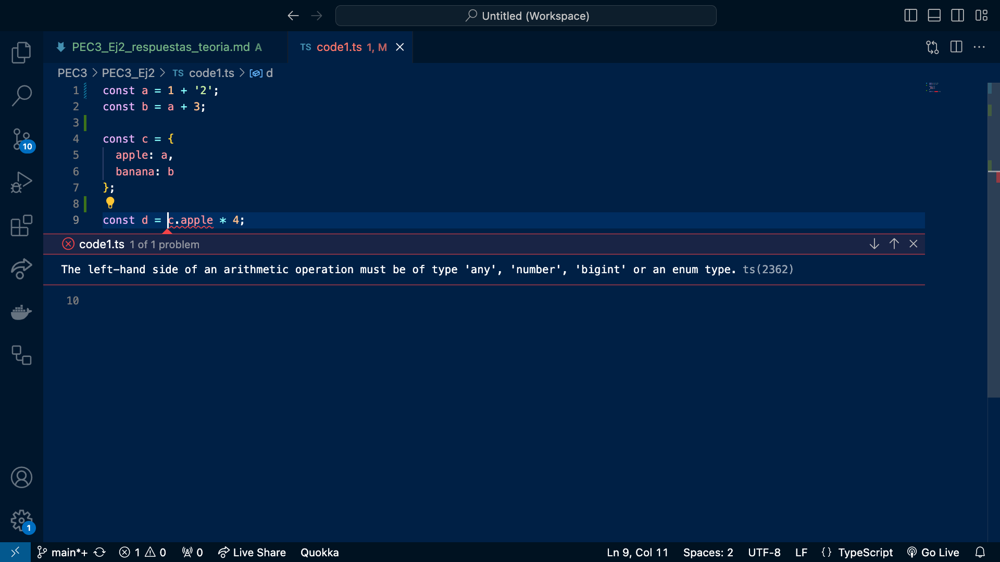

## Ejercicio 2: Teoría:

A. En la siguiente imagen se muestra un error de tipo detectado por typescript en el archivo core1.ts. El error es provocado en la constante a ```const a = 1 + '2';``` al convertir un número a una cadena de texto. 
Gracias a que Typescript infiere el tipo de todas las variables del archivo, detecta el valor de ```apple```como string y lanza error de tipo en la constante ```d```, misma que intenta hacer una operación aritmética sobre tipo string: ```const d = c.apple * 4;```. 

Lo que hace Typescript en este ejemplo es útil ya que detecta errores de tipo antes de que el código se ejecute, lo que facilita la identificación y corrección de errores, así como la colaboración y la integración de código.




B.

1. (1 punto) Para cada uno de los valores del fichero code2.ts, ¿Qué tipo de datos inferirá TypeScript? Explica por qué se ha inferido este tipo de datos.

- a => number: El valor proporcionado de ``a`` es un número, por lo que Typescript infiere que es de tipo number.
- b => string: El valor proporcionado de ```b``` es una cadena de texto, por lo que Typescript infiere que es de tipo string.
- c => string: El valor proporcionado de ```c``` es una cadena de texto, por lo que Typescript infiere que es de tipo string.
- d => boolean[]: El valor proporcionado es un array de booleanos, por lo que TypeScript infiere que ```d``` es de tipo boolean[].
- e => {
    type: string;
} :  El valor es un objeto con una propiedad type que contiene una cadena, por lo que TypeScript infiere que ```e``` es de tipo { type: string }.
- f => (number | boolean)[]: El array contiene elementos de tipos diferentes (número y booleano), por lo que TypeScript infiere un tipo de array que puede contener tanto números como booleanos.
- g => number[]: Aunque el array contiene un solo elemento, ese elemento es un número, por lo que TypeScript infiere que ```g``` es de tipo number[].
- h => null: TypeScript infiere que ```h``` es de tipo null porque el valor proporcionado es null.

Es importante destacar que TypeScript utiliza la inferencia de tipo para deducir el tipo de las variables según el valor asignado inicialmente. En algunos casos, la inferencia puede ser bastante precisa, mientras que en otros casos, especialmente cuando hay varios tipos posibles, TypeScript puede inferir tipos más generales (como en el caso de la constante ```f```).

2. (1 punto) ¿Por qué se dispara cada uno de los errores del fichero code3.ts?

a.- 
```
const i: 3 = 3;
i = 4; // Error TS2588 : Cannot assign to 'i' because it is a constant.ts(2588)
```;

La constante i se declara con un tipo literal de valor 3. Al asignar un valor diferente a i (en este caso, 4), TypeScript arroja un error indicando que no se puede asignar a i porque es una constante con un tipo literal.

Este comportamiento es parte de la naturaleza de TypeScript cuando se utiliza el tipo literal. Al asignar un valor literal a una constante con un tipo literal específico, TypeScript asegura que el valor asignado sea exactamente igual al tipo literal especificado. En este caso, i se declara con el tipo literal 3, por lo que solo puede tener el valor 3.

Los tipos literales son útiles en situaciones donde deseas limitar las posibles opciones para una variable y quieres que el sistema de tipos te ayude a detectar posibles errores en tiempo de compilación. Este enfoque ayuda a prevenir posibles errores y mejora la seguridad del tipo en tu código.

b.- 
```
const j = [1, 2, 3];
j.push(4);
j.push('5'); // Error TS2345: Argument of type '"5"' is not assignable to parameter of type 'number'.´´´

En este ejemplo ```j``` se infiere como tipo array basándose en los elementos proporcionados. En este caso, ```j``` es de tipo number[] porque los elementos iniciales son números. El error sucede al intentar añadir una cadena ('5') a un array que se espera que contenga solo números. Por lo tanto, arroja un error indicando que el argumento de tipo '"5"' no es asignable al parámetro de tipo 'number'.

c.- ```let k: never = 4; // Error TSTS2322: Type '4' is not assignable to type 'never'.````

El tipo never en TypeScript representa un conjunto de valores que nunca ocurren, y generalmente se utiliza para expresar funciones que lanzan excepciones o entran en bucles infinitos. Cuando se intenta asignar un valor al tipo never, TypeScript se asegura de que el valor asignado no sea de ningún tipo válido. En tu caso, se está intentando asignar el valor 4 al tipo never, lo cual es incorrecto.

d.- 
```
let l: unknown = 4;
let m = l * 2; // Error TS2571: Object is of type 'unknown'.
```

En este caso, se asigna el valor 4 a la variable ```l``` con el tipo ```unknown```. Cuando se intenta multiplicar ```l``` por 2, TypeScript arroja un error indicando que el objeto es de tipo ```unknown```. Esto se debe a que TypeScript no puede garantizar que ```l``` sea un número y no permite realizar operaciones aritméticas directas en valores de tipo ```unknown```.

Se podría corregir verificando el tipo de ```l``` antes de realizar operaciones, así TypeScript entienda que el valor ```l``` es de tipo number dentro del bloque condicional y, por lo tanto, permitirá realizar la multiplicación de manera segura.

3. (0.5 puntos) ¿Cuál es la diferencia entre una clase y una interface en TypeScript?

